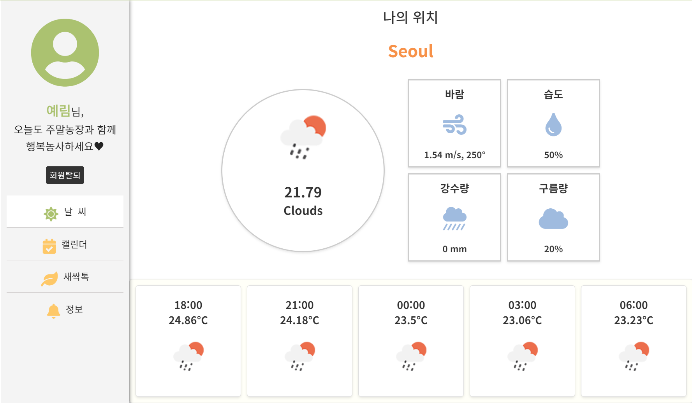
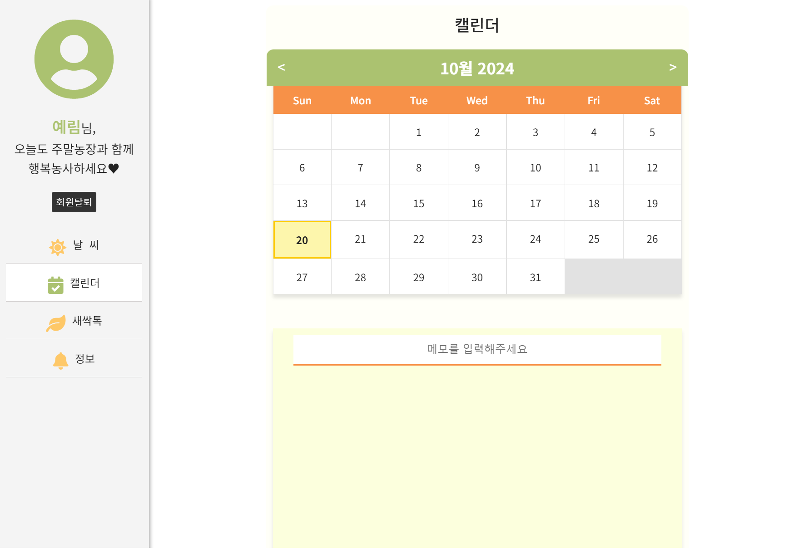
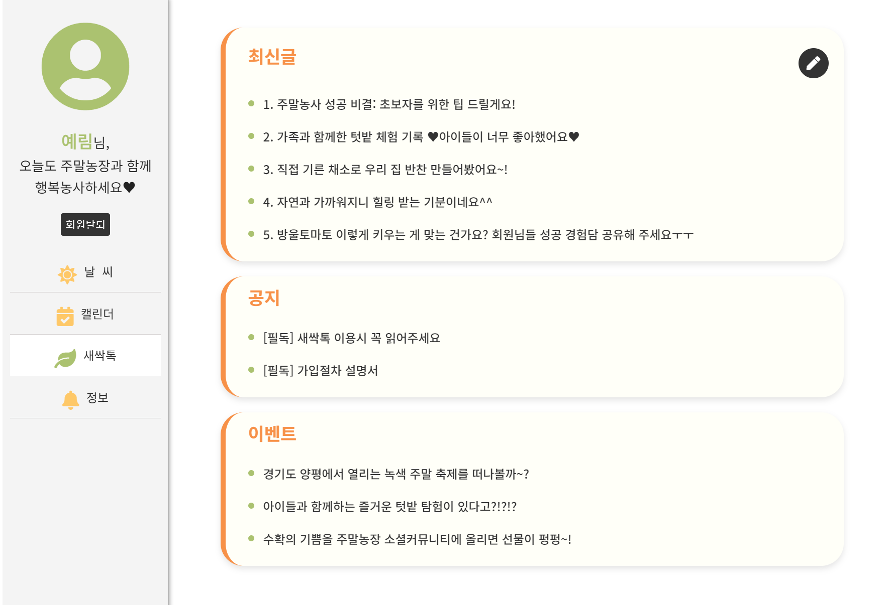
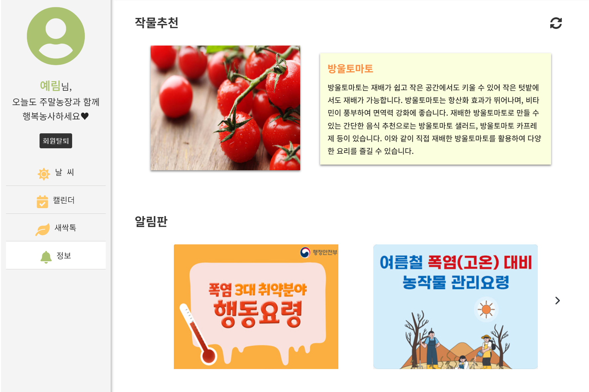
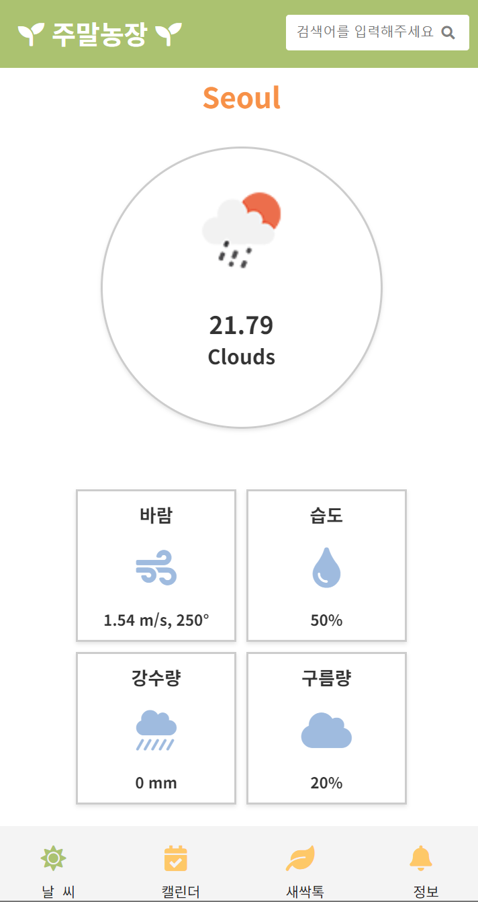
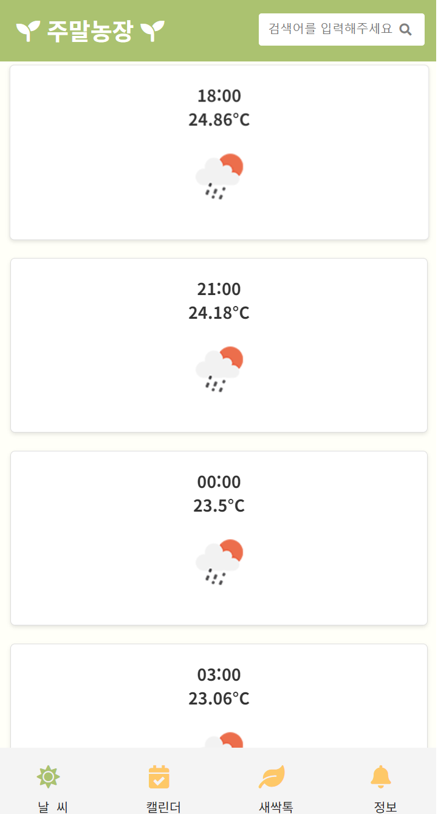
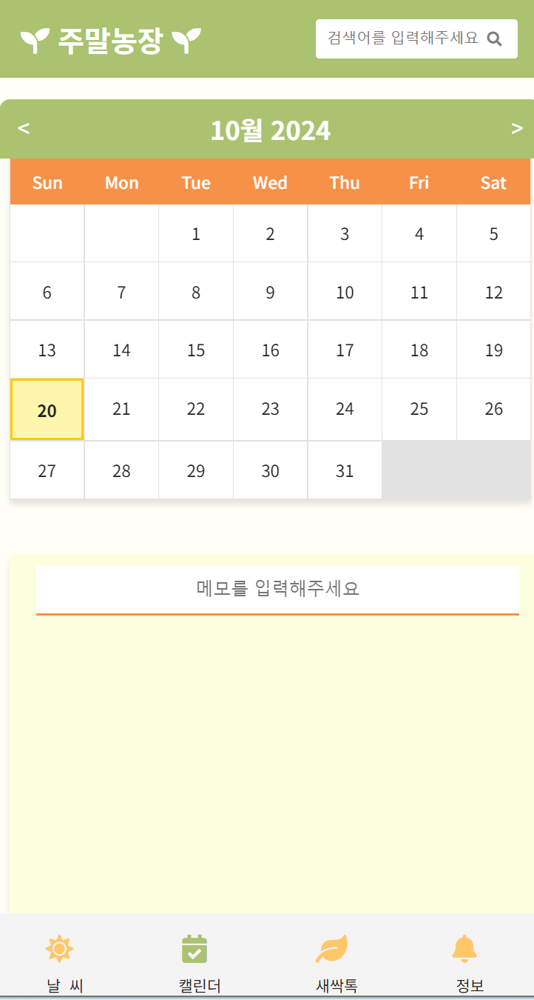
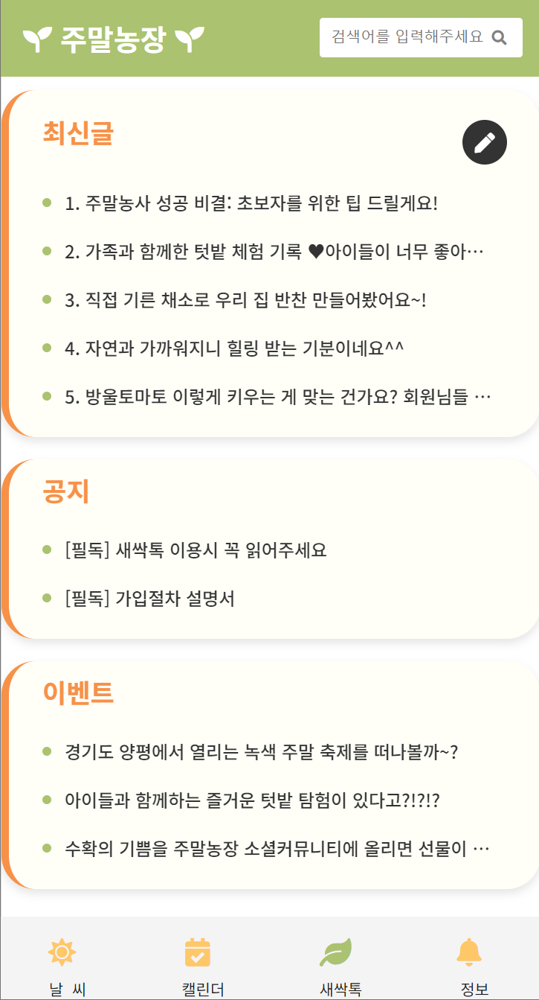
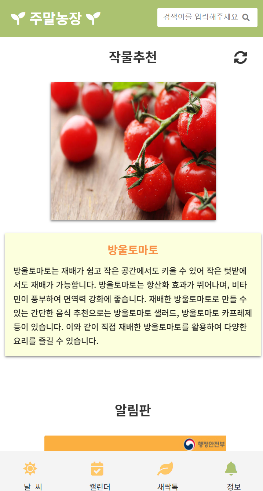
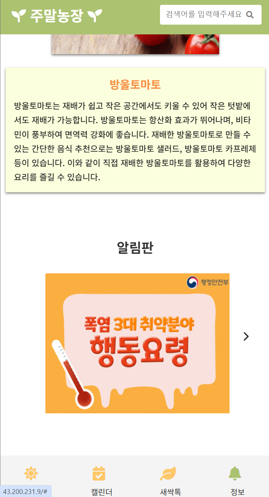

# Weekend Farm 🌱
주말 농장 반응형 웹 사이트 


<br><br>  


## 1. Project Overview (프로젝트 개요)  


- **프로젝트 이름**: 주말농장  


- **목적**: 주말에 농장을 운영하며 취미로 즐기는 사용자들을 위해, 날씨 정보와 일정 관리, 커뮤니티 및 작물 추천 기능을 제공하는 웹 사이트


- **대상**: 자녀와 함께 건강한 활동을 원하는 젊은 부모, 직장인 

<br><br>  


## 2. Development Period (개발 기간)

### 개발 기간
-  2024-07-08 ~ 2024-07-22


<br><br>  


## 3. Key Features (주요 기능)

### 1. 날씨 정보 제공:

  - 주말 농장 운영에 필요한 온도, 바람, 습도, 강수량, 구름량의 날씨 정보를 실시간으로 제공


### 2. 일정 관리:

  - 작물을 관리할 때 일정을 관리하고 확인할 수 있는 기


### 3. 작물 추천:
  
  - 주말농장에서 키우기 좋은 작물 추천


<br><br>


## 4. Project Structure (프로젝트 구조)

```
WeekendFarm/
├── css/                     # 스타일시트 파일 (CSS)
├── images/                  # 이미지 파일
├── js/                      # JavaScript 파일들
│   ├── alarm.js             # 알림판 관련 JS 파일
│   ├── calendar.js          # 캘린더 관련 JS 파일
│   ├── info.js              # 작물추천 관련 JS 파일
│   ├── login.js             # 로그인 관련 JS 파일
│   ├── slide.js             # 슬라이드 관련 JS 파일
│   ├── todo.js              # 할 일 목록 관련 JS 파일
│   ├── weather.js           # 날씨 관련 JS 파일
├── index.html               # 메인 HTML 파일
├── README.md                # 프로젝트 설명 파일
└── NeedsStatement.pptx      # 프로젝트 요구사항 설명 파일 (PPT)


```


<br><br>

## 5. Tech Stack (기술 스택)

### Frontend


### Tools


<br><br>

## 6. Site Link (사이트 링크)
http://43.200.231.9/


<br>

## 7. Site Introduction (사이트 소개)


## 7-1. Web Version
웹 버전에서는 사용자가 주말농장을 통해 다양한 활동을 쉽게 관리하고 정보를 얻을 수 있도록 설계되었습니다. 각 페이지는 사용자가 농장을 관리하는 데 필요한 기능을 제공합니다.

| 페이지 이름        | 설명                                                                 | 스크린샷                    |
|-----------------|----------------------------------------------------------------|---------------------------|
| 날씨 정보 페이지   | 현재 사용자의 위치를 기반으로 날씨 정보를 제공합니다. 풍속, 습도, 강수량, 구름량 등의 상세 정보를 확인할 수 있습니다. |  |
| 캘린더 페이지     | 주간/월간 일정 관리를 통해 사용자가 농장 일정을 관리할 수 있습니다. |  |
| 새싹톡 커뮤니티 페이지 | 최신글, 공지사항, 이벤트 섹션이 있으며, 커뮤니티 활동을 통해 사용자들이 정보를 공유할 수 있습니다. |  |
| 작물 추천 및 알림판 페이지 | 사용자가 재배할 수 있는 작물을 추천하고, 알림판을 통해 농사 관리에 필요한 정보를 제공합니다. |  |

## 7-2. App Version
앱 버전에서는 사용자가 주말농장을 모바일 기기를 통해 언제 어디서나 쉽게 관리하고 정보를 확인할 수 있습니다. 각 페이지는 모바일 환경에 최적화되어 있습니다.

| 페이지 이름        | 설명                                                                 | 스크린샷                    |
|-----------------|----------------------------------------------------------------|---------------------------|
| 메인 페이지       | 모바일 인터페이스에 맞춘 레이아웃과 손쉬운 메뉴 접근 기능을 제공합니다.  |   |
| 날씨 정보 페이지   | 현재 사용자의 위치를 기반으로 날씨 정보를 제공합니다. 풍속, 습도, 강수량, 구름량 등의 상세 정보를 확인할 수 있습니다. |   |
| 캘린더 페이지     | 일정 관리 기능을 모바일에서도 사용할 수 있습니다. |  |
| 새싹톡 커뮤니티 페이지 | 커뮤니티 활동을 모바일에서도 쉽게 사용할 수 있습니다. |  |
| 작물 추천 및 알림판 페이지 | 사용자가 재배할 수 있는 작물을 추천하고, 알림판을 통해 농사 관리에 필요한 정보를 제공합니다. |   |


